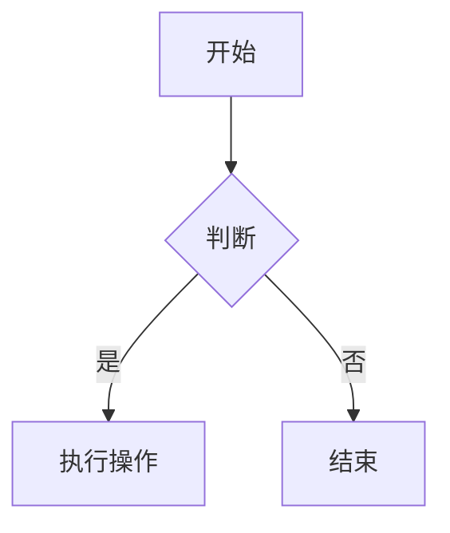
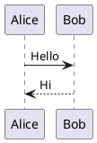

# 全功能 Markdown 测试文档

> 本文档用于测试 Markdown 解析器对 CommonMark、GFM 及常见社区扩展的支持。
> 部分语法为扩展功能，实际渲染效果取决于解析器与插件。

## 目录

[[toc]]

## 1. 核心语法 (CommonMark)

### 1.1 标题

# H1 标题
## H2 标题
### H3 标题
#### H4 标题
##### H5 标题
###### H6 标题

Setext 风格：

一级标题
===

二级标题
---

### 1.2 段落与换行

这是一个普通段落。

这是另一个段落，中间有空行。

这是同一段落内的换行，  
行尾有两个空格实现硬换行。

这是使用反斜杠的硬换行\
下一行。

### 1.3 强调

*斜体* 或 _斜体_

**粗体** 或 __粗体__

***粗斜体*** 或 ___粗斜体___

### 1.4 列表

无序列表：

- 项目 A
- 项目 B
  - 嵌套项目 B1
  - 嵌套项目 B2
- 项目 C

有序列表：

1. 第一项
2. 第二项
   1. 嵌套有序 2.1
   2. 嵌套有序 2.2
3. 第三项

混合列表：

- 项目
  1. 有序子项
  2. 有序子项
- 项目

### 1.5 代码

行内代码：`const a = 1;`

围栏代码块：

```javascript
function hello() {
  console.log('Hello, Markdown!')
}
```

缩进代码块：

    indented code block
    line 2

### 1.6 链接与图片

[普通链接](https://example.com)

[带标题的链接](https://example.com "示例网站")

<https://example.com>


[](https://example.com)

### 1.7 引用

> 这是一级引用。
>
> > 这是嵌套引用。
>
> 回到一级引用。

### 1.8 分隔线

---

***

___

## 2. GFM 扩展

### 2.1 表格

| 左对齐 | 居中对齐 | 右对齐 |
| :--- | :---: | ---: |
| 单元格 | 单元格 | 单元格 |
| 内容 | 内容 | 内容 |

### 2.2 任务列表

- [x] 已完成任务
- [ ] 未完成任务
- [ ] 待办事项

### 2.3 删除线

~~删除线文本~~

### 2.4 自动链接

https://example.com

www.example.com

user@example.com

### 2.5 脚注

这是一个脚注引用[^1]，还有另一个[^note]。

[^1]: 这是脚注内容。
[^note]: 这是命名脚注。

### 2.6 警告框

> [!NOTE]
> 这是一条提示信息。

> [!TIP]
> 这是一条技巧信息。

> [!IMPORTANT]
> 这是一条重要信息。

> [!WARNING]
> 这是一条警告信息。

> [!CAUTION]
> 这是一条注意事项。

## 3. 内容增强

### 3.1 Emoji

:smile: :heart: :+1: :rocket:

### 3.2 上下标

H~2~O

x^2^ + y^2^ = z^2^

### 3.3 高亮/标记

==高亮文本==

### 3.4 缩写词

*[HTML]: 超文本标记语言
*[CSS]: 层叠样式表

HTML 和 CSS 是网页基础。

### 3.5 定义列表

术语 1
: 定义 1

术语 2
: 定义 2
: 另一个定义

### 3.6 插入与删除

<ins>插入文本</ins>

<del>删除文本</del>

### 3.7 Ruby 注音

{漢字|かんじ}

### 3.8 剧透

>! 这是剧透内容，点击显示。

### 3.9 图标

:icon-name:

## 4. 学术与技术

### 4.1 数学公式 (KaTeX)

行内公式：$E = mc^2$

块级公式：

$$
\int_{-\infty}^{\infty} e^{-x^2} dx = \sqrt{\pi}
$$

### 4.2 MathJax

行内：\(a^2 + b^2 = c^2\)

块级：

\[
\frac{\partial}{\partial t} \Psi = i\hbar \frac{\partial}{\partial t} \Psi
\]

### 4.3 代码高亮

```python
def greet(name):
    return f"Hello, {name}!"
```

### 4.4 代码行号

```javascript {1,3-5}
// 第 1 行高亮
const a = 1
const b = 2
// 第 4 行
// 第 5 行
const c = 3
```

## 5. 图表与可视化

### 5.1 Mermaid



### 5.2 PlantUML



### 5.3 ECharts

```echarts
{
  "title": { "text": "示例图表" },
  "xAxis": { "type": "category", "data": ["A", "B", "C"] },
  "yAxis": { "type": "value" },
  "series": [{ "data": [10, 20, 30], "type": "bar" }]
}
```

### 5.4 Flowchart

```flow
st=>start: 开始
op=>operation: 操作
cond=>condition: 判断?
e=>end: 结束

st->op->cond
cond(yes)->e
cond(no)->op
```

## 6. 文档导航与结构

### 6.1 标题锚点

## 带自定义 ID 的标题 {#custom-heading}

[跳转到自定义标题](#custom-heading)

### 6.2 目录

[[toc]]

### 6.3 属性

# 标题 {#id .class style="color: red"}

段落文本 {.highlight}

### 6.4 自定义容器

::: warning
这是一个警告容器。
:::

::: tip
这是一个提示容器。
:::

::: details
这是一个可折叠的详情容器。
:::

### 6.5 选项卡

::: tabs

@tab 标签 1
内容 1

@tab 标签 2
内容 2

:::

### 6.6 布局

::: layout
::: col
左列内容
:::
::: col
右列内容
:::
:::

## 7. 其他实用功能

### 7.1 图片尺寸


### 7.2 图片懒加载


### 7.3 图片预览

[](https://via.placeholder.com/800)

### 7.4 主题标记


### 7.5 包含文件

@include "other.md"

### 7.6 导入代码片段

@snippet "file.js"#section

### 7.7 自定义嵌入

@embed "component"

### 7.8 内容对齐

->居中内容<-

->右对齐内容->

<-左对齐内容<-

### 7.9 样式化

!! 样式化文本 !!

## 8. 总结

本文档覆盖了 CommonMark、GFM 及常见 Markdown 扩展语法。  
使用不同解析器时，请根据实际支持的插件启用相应功能。

---

*测试文档结束。*